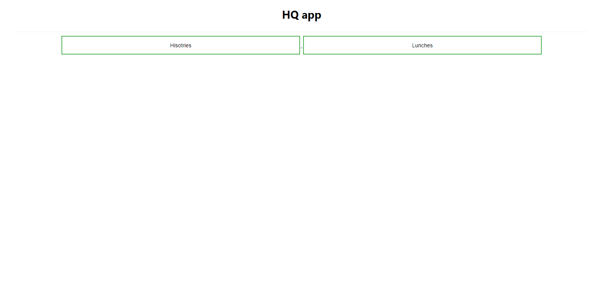
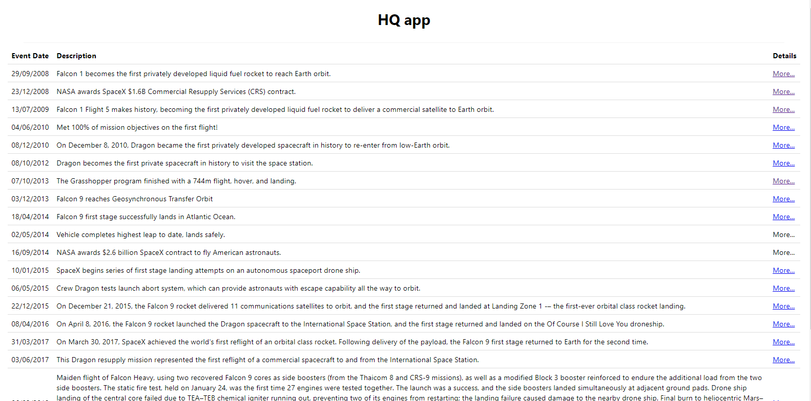
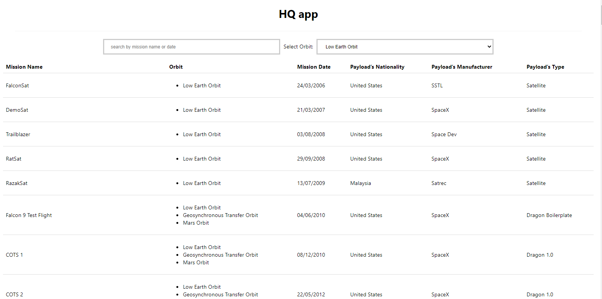
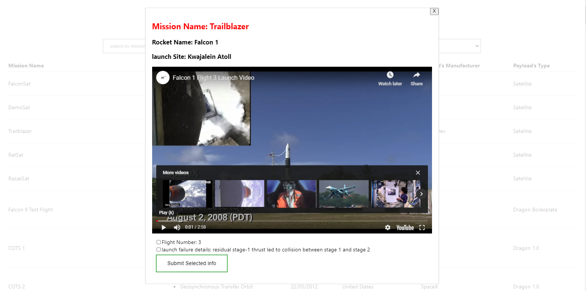

`Here is the all launch list and details page`
 # Technologies I have used
React, redux, redux-saga, axios , webpack.

First install node_modules by

### `npm install`

Then run the app by following command
### `npm start`

It will start on port 3000

Please see the `screenshot` to see the view

